# Gazes

Gazes is a self-hosted anime streaming platform built on BitTorrent. It finds releases for the episode you pick, downloads them sequentially, remuxes them on the fly into a browser-friendly format and plays them in a web player with styled subtitles, audio selection and automatic source fallback. Nothing is hosted permanently: torrent data lives in ephemeral buffers, and the catalog comes from AniList. Accounts are optional and only used to keep watch progress across devices.

## Showcase

### Demo

[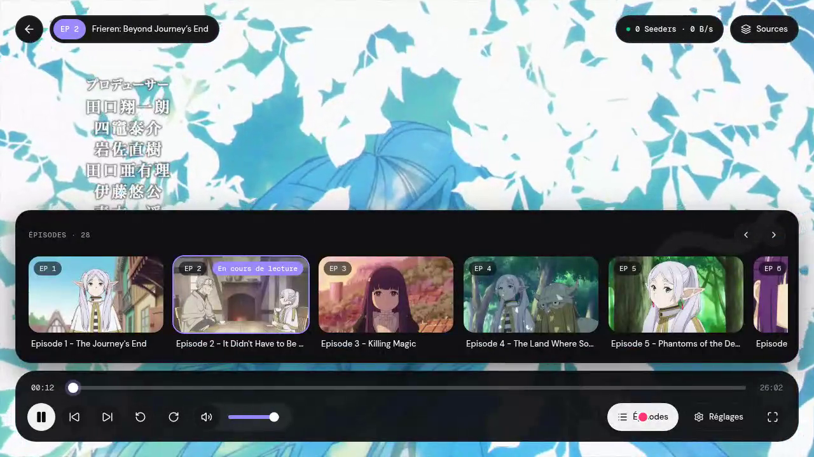](docs/demo/demo.mp4)

A walkthrough of the classic flow: browse the home page and release calendar, open Frieren from the search, go through the series and season pages, play episode 2 and open the episode picker and the Sources modal (click the image to play the video).

| | |
| --- | --- |
| 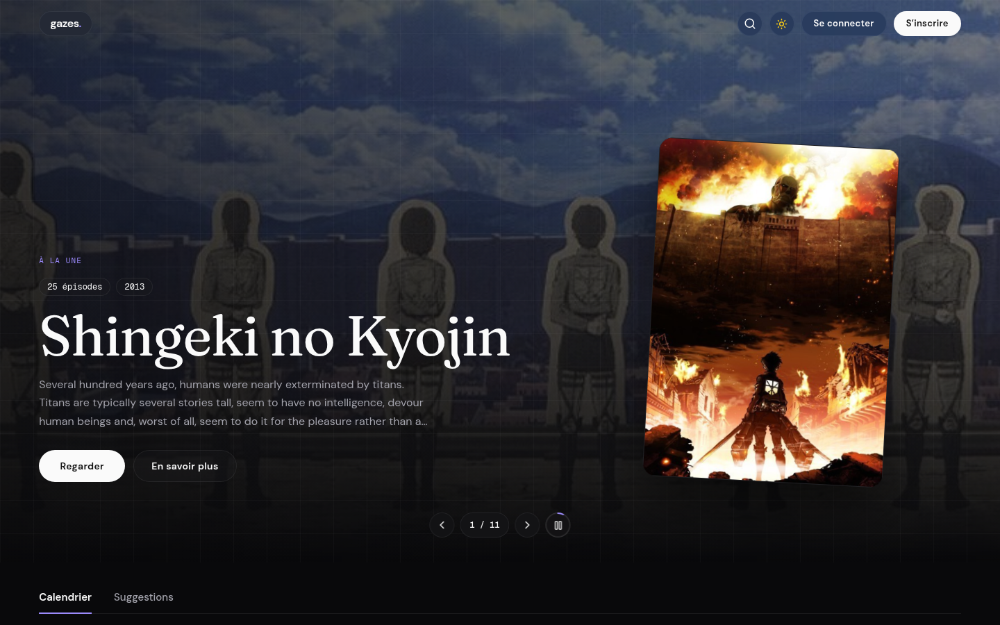 | 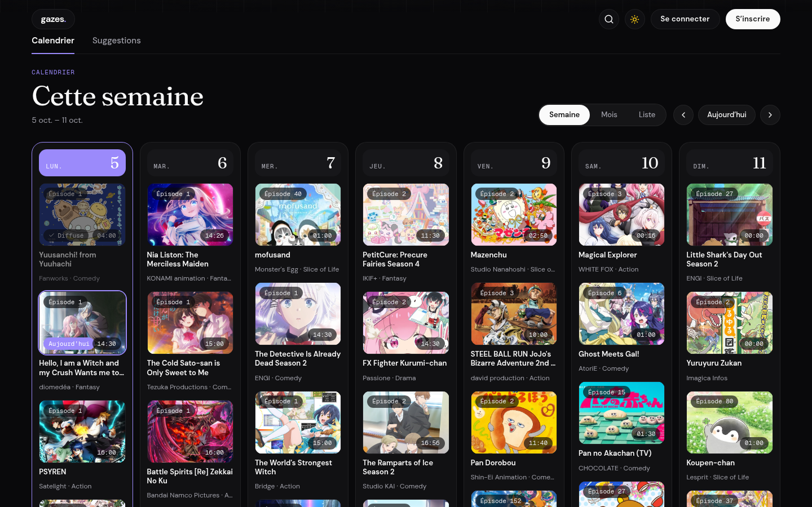 |
| Home page with the featured carousel. | Weekly release calendar (week, month and list views). |
| 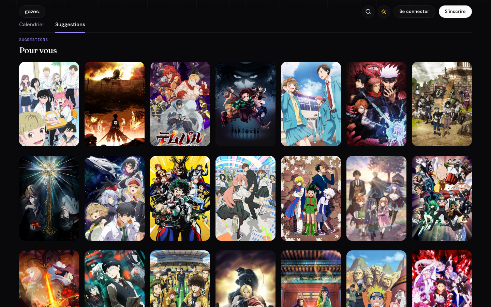 | 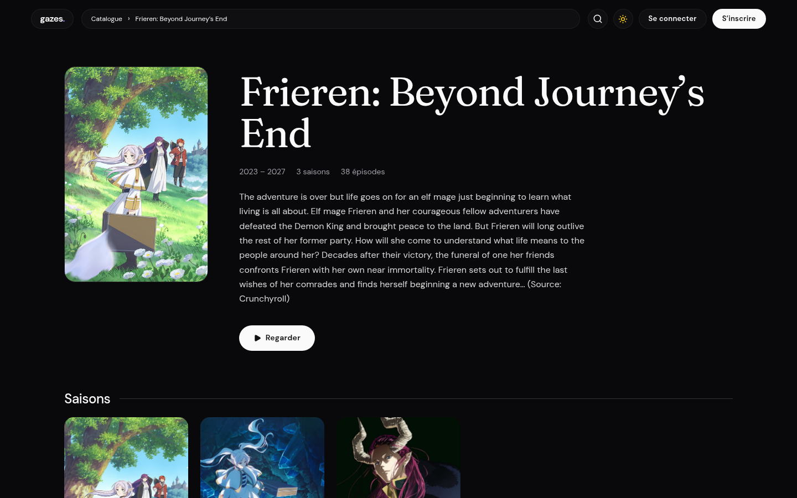 |
| Catalog suggestions grid. | Franchise page with its seasons. |
| 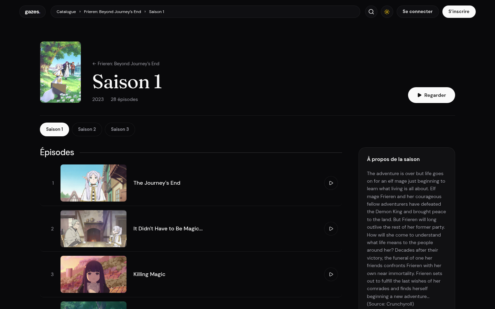 | 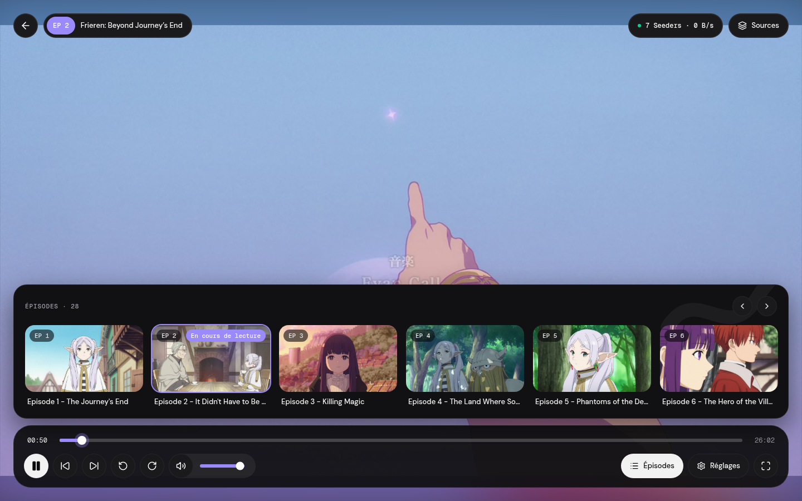 |
| Season page with episode list. | Player with the episode picker open. |
| 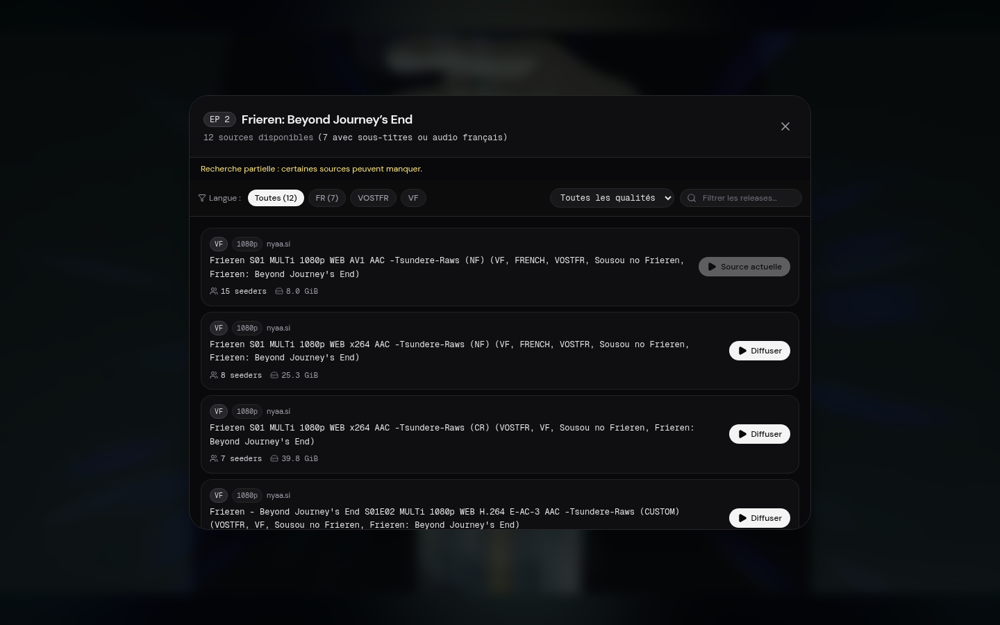 | 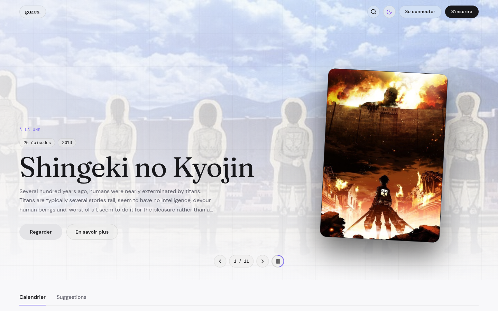 |
| Source selector with language and quality filters. | Light theme. |
| 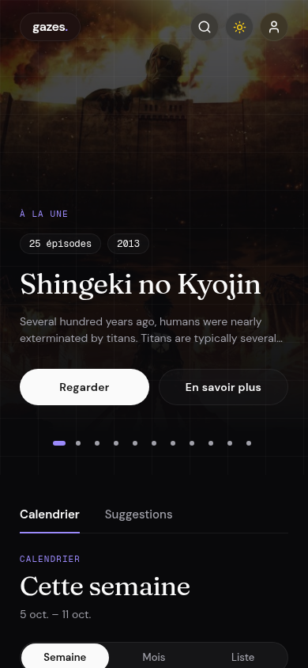 | 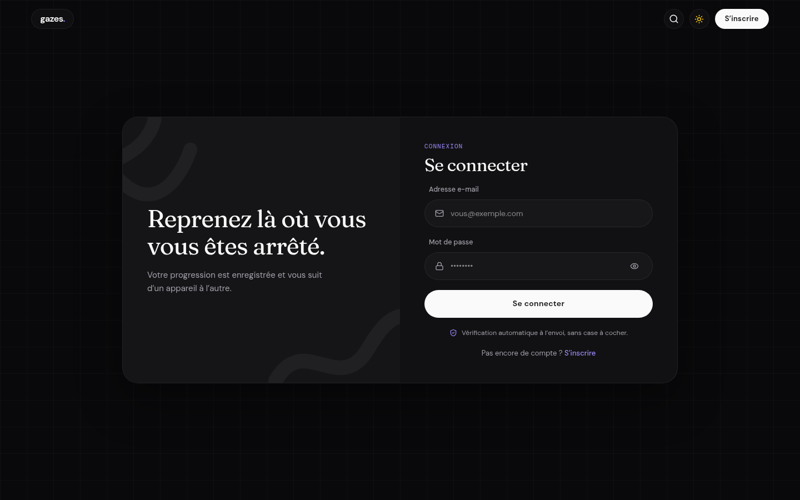 |
| Mobile layout (390x844). | Login page. |

## Features

- **Catalog and discovery.** Navigation through shareable franchise, season and episode pages. Identities and relationships come from AniList (main continuity, movies and side stories are grouped separately). A featured carousel, a seasonal grid for the current quarter and a release calendar (week, month, list) are on the home page.
- **Torrent sources.** Direct Nyaa integration plus AniDex and The Pirate Bay through Prowlarr, with optional EXT and MagnetDL providers and Sonarr-assisted resolution. Releases are matched to the selected season, then ranked (seeded first; VF/VOSTFR, MULTI, seeders and resolution are scored). Packs only open the requested episode file; ambiguous matches are skipped.
- **Instant playback.** Sequential piece scheduling with priority on headers and the playback window, request-aware cancellation on seek, and automatic fallback to the next source when metadata, first video or playback progress time out.
- **Low-CPU media pipeline.** Video is remuxed (H.264/H.265 copied into fragmented MP4), and only incompatible audio (AC3, EAC3, DTS, FLAC) is transcoded.
- **Player.** Audio track selection, ASS/SSA subtitles rendered with JASSUB (WebVTT extraction also available), a Sources modal to switch torrents without losing position (works in fullscreen), skip-segment buttons, episode picker and debug panel.
- **Optional accounts.** Watch history across devices, argon2id password hashing, encrypted emails, post-quantum credential envelope and a proof-of-work captcha.
- **AV1 library.** Optional local copy of watched episodes on dedicated disks, re-encoded to AV1 to save space. Library failures never block torrent playback.
- **Shared Redis state.** Caches, upstream rate limits and auth state shared by every backend instance and every stack on a host.
- **Diagnostics.** Sanitized structured logs, a `gazes-logs` CLI and a cache diagnostics endpoint.
- **Localization.** French and English interface, selected from browser preferences or the footer, with light and dark themes.

## Architecture

```
  Browser (Next.js app, player, JASSUB subtitles)
      |
      |  HTTPS / HTTP Range, fMP4 segments
      v
  Edge (optional Caddy, hybrid post-quantum TLS)
      |
      v
  Web (Next.js, proxies /api to the backend)
      |
      v
  Backend (Go: API, auth, catalog, resolver, torrent engine, remux pipeline)
      |-- AniList (catalog, calendar)           through a Redis-backed cache
      |-- Nyaa (direct), Prowlarr gateways -----> torrent indexers
      |-- Sonarr (optional episode resolution)
      |-- BitTorrent swarm (TCP/uTP, DHT, PEX, trackers)
      |-- FFmpeg / ffprobe (remux, audio transcode, subtitles, AV1 library)
      |-- Redis (shared cache, locks, rate limits, auth nonces)
      `-- Local volumes (accounts, diagnostics, ephemeral torrent buffers,
                         AV1 library pool)
```

Key invariants: video tracks are never re-encoded for playback, pieces are scheduled by playback position rather than rarest-first, buffers are ephemeral and purged when no viewer is attached, and swarm stalls are handled with timeouts and fallbacks rather than blocking requests.

## Tech stack

| Layer | Technology |
| --- | --- |
| Backend | Go 1.26, chi router, `anacrolix/torrent` |
| Media | FFmpeg and ffprobe (remux, audio transcode, subtitle extraction, AV1 encoding) |
| Frontend | Next.js 16, React 19, TypeScript, Tailwind CSS 4, hls.js, JASSUB |
| Cryptography | argon2id, AES-256-GCM, ML-KEM-768 (`@noble/post-quantum` in the browser, Go `crypto/mlkem` on the server), ALTCHA |
| Indexing | Nyaa (direct), Prowlarr with FlareSolverr (AniDex, The Pirate Bay, others), optional Sonarr |
| State | Redis (shared cache and auth state), SQLite (accounts, diagnostics) |
| Delivery | Docker Compose, optional Caddy edge |
| Testing | Go tests, Node file-selection tests, Playwright browser tests |

## Getting started

### Docker development environment

Requires Docker Engine, Docker Compose v2.24+ and GNU Make. No local Go, Node, pnpm or FFmpeg installation is needed.

```sh
make dev          # Start Redis, build development images, install dependencies, wait for health
make dev-logs     # Follow service logs
make dev-check    # Go vet, ESLint, TypeScript checks and tests
make dev-test     # Go tests and frontend file-selection tests
make dev-restart  # Recompile and restart the backend after Go changes
make dev-down     # Stop the environment, keeping volumes
```

Open [http://localhost:8080](http://localhost:8080). Frontend source is mounted into the Next.js container and reloads automatically. Backend source is mounted read-only, so run `make dev-restart` after Go edits. The first start can take several minutes; `DEV_WAIT_TIMEOUT` (default 600 seconds) can be raised on slower machines. After changing frontend dependencies, restart the web container with `docker compose -p gazes-dev -f compose.yaml -f compose.dev.yaml restart web`.

The development project uses separate `gazes-dev` containers and volumes (Prowlarr configuration, diagnostics, Go and pnpm caches, frontend build output, a dummy library pool). It shares port 8080 with the production stack: stop that stack first or run `GAZES_PORT=8081 make dev`. `make help` lists every target.

### Production stack

```sh
make secrets      # Generate account keys into .env (kept if already set)
make up           # secrets + shared Redis + docker compose up -d --build --wait
make down         # Stop, preserving volumes
```

`make up` is equivalent to `docker compose up -d --build --wait` once secrets and Redis exist. Open `http://SERVER:8080` (`GAZES_PORT` changes the port). The frontend, the FFmpeg-enabled backend and Prowlarr start together. The backend also publishes the torrent port (`TORRENT_PORT`, default 42069, TCP and UDP); forward it on your router for better swarm reach. `make up-admin` additionally exposes Prowlarr on loopback (see Indexers).

### Native run

Requires Go, FFmpeg with ffprobe, Node and pnpm.

```sh
make deps          # Download Go modules, install locked frontend dependencies
make dev-backend   # Backend on port 8090 (PORT overrides it)
make dev-web       # Frontend dev server on port 4389
make build         # Build bin/gazes-server, gazes-logs, gazes-library and the frontend
make start-web     # Serve the built frontend on port 4389
```

The frontend proxies to `BACKEND_URL` (default `http://127.0.0.1:8090`). Native commands use `-tags=nosqlite` (see Diagnostics). The backend refuses to start without Redis (`REDIS_URL`), so run `make redis-up` first or point it at an existing instance.

### Testing

```sh
make check                                             # lint, type checks and tests
go test -tags=nosqlite -race ./internal/... ./cmd/...
node web/scripts/episode-file.test.mjs
PLAYWRIGHT_BROWSER=chromium node web/scripts/auto-playback.test.mjs
```

Browser tests are opt-in and need Playwright browsers; set `PLAYWRIGHT_CHROMIUM_EXECUTABLE_PATH` (or `FIREFOX_PATH`) for a system installation. From `web`: `npm run test:seasons` (mocked browse flow, frontend on port 4391), `npm run test:design` (layout, scrolling, search, focus), `npm run test:i18n` (frontend on port 4392), `npm run test:player` (modal and JASSUB with a simulated clock), `npm run test:sources` (score ordering and fallback). `TEST_BASE_URL` overrides the target address. `go test -tags=nosqlite ./internal/stream -run TestHEVCAudioSwitch -v` checks HEVC, AAC copy, AC3 conversion and seek sync.

## Configuration

Settings go in `.env` for Docker; exported variables also work natively.

### Playback behaviour

Episode pages start automatically with seeded sources first, then score, then swarm strength. Duplicate magnets are tried once and individual releases are preferred over equally ranked packs. Each attempt allows 12 seconds for metadata and 20 seconds for the first video; a playing stream whose time does not advance for 15 seconds is replaced (pausing does not count). Failed sources advance automatically and keep the playback position. After all candidates fail, retry is explicit.

Scoring adds 100 for explicit VF/VOSTFR (once), 2 for MULTI, up to 60 for seeders (logarithmic) and 0 to 4 for resolution; leechers add nothing, and MULTI alone does not confirm French availability. Zero-seeder releases are attempted last. Searches use `Anime Name S01E01` for each title alias: the franchise season shown in the UI is separate from the release season (Naruto Shippuden is Naruto's second entry but searches `Naruto Shippuden S01E01`). Renamed continuations restart at S01, explicitly numbered titles keep their season, and more specific sibling titles are excluded. Confirmed absolute-numbering or split-part mappings can be added to `internal/indexer/numbering.go`, which starts empty on purpose. Fan edits and recuts are rejected when resolving episodes.

The season-aware catalog API lives under `/api/v1/catalog/anime/{id}`: `/franchise`, `/seasons/{season}` and `/seasons/{season}/episodes/{ep}/sources` (the older episode-source URL still works). Responses expose `has_next_page`, `partial`, `warning` and score breakdowns. `/api/v1/catalog/seasonal` filters by the current calendar quarter. Provider pagination and searches are bounded.

Subtitles: extraction defaults to WebVTT; `format=ass` keeps ASS styles and converts other text subtitles for JASSUB. Fonts missing from a track fall back to the bundled Liberation Sans. Worker, WASM and font assets are generated by the dev and build scripts. JASSUB is pinned because the worker build selects its Canvas2D renderer on Firefox; review that patch before upgrading.

### Indexers

Prowlarr is provisioned automatically. Initialization creates a random API key in the persistent `prowlarr-config` volume; provisioning reuses existing AniDex and The Pirate Bay indexers or creates them from official Prowlarr schemas (missing definitions are skipped with a warning), preserves manual settings and disabled indexers, and exports other already-enabled torrent indexers as gateways named `prowlarr-<id>`. New indexers are created disabled with `forceSave=true` and then enabled with a forced PUT, which avoids external network tests at deploy time. A private checkpoint makes activation resumable; API errors fail provisioning visibly, while unreachable external sites do not block startup. The backend reads Torznab endpoints and the key from a read-only internal volume; credentials never reach the frontend or error messages.

Nyaa stays direct and independent. In manifest mode AniDex and The Pirate Bay are queried only through Prowlarr. EXT and MagnetDL are disabled by default; enable one with `INDEXER_EXT_DISABLED=false` or a configured endpoint. Per-provider variables (names: `EXT`, `MAGNETDL`, `ANIDEX`, `THEPIRATEBAY`):

- `INDEXER_<NAME>_DISABLED=true` disables the provider; an explicit disable wins over a configured gateway.
- `INDEXER_<NAME>_TORZNAB_URL` and `INDEXER_<NAME>_API_KEY` override its gateway.
- `INDEXER_<NAME>_URL` overrides a direct connector's URL.

Extra manifest gateways can be disabled by stable name, for example `INDEXER_PROWLARR_32_DISABLED=true`. Native development without `INDEXER_CONFIG_FILE` can still use the direct AniDex and The Pirate Bay connectors.

Prowlarr is not published. For local administration, run `docker compose -f compose.yaml -f compose.admin.yaml up -d --build --wait` (or `make up-admin`) and open `http://127.0.0.1:9696` on the server or through an SSH tunnel. A fresh installation uses External authentication, so only enable this override on a trusted server; existing authentication settings are never replaced.

Queries keep a per-provider concurrency of two, four-second deadlines, coalescing, bounded caches (256 entries per provider, two minutes for results, 15 seconds for empty answers) and a 30-second failure cooldown. Results merge by infohash. Prowlarr outages return partial results from Nyaa instead of stopping Gazes.

### Sonarr (optional)

Gazes can delegate series, season, episode and release matching to a separately operated Sonarr instance. Set `SONARR_URL` and `SONARR_API_KEY` in the backend's private environment. When Sonarr returns a magnet for the selected episode it is used directly; an unavailable Sonarr or unusable release falls back to the built-in resolver. Sonarr is not exposed by Gazes and its key never reaches the frontend.

### Accounts

Accounts are optional. Playback works without one; a signed-in viewer keeps watch progress across devices.

- Passwords are mixed with a server pepper (HMAC-SHA256) and hashed with argon2id. Emails are encrypted at rest with AES-256-GCM; a keyed HMAC blind index enforces uniqueness without storing a readable address.
- Credentials in transit are wrapped in an ML-KEM-768 envelope (HKDF-SHA256, AES-256-GCM) bound to its route and to a single-use server nonce, so it cannot be replayed. This sits on top of TLS and does not replace it.
- Bots are stopped by a self-hosted ALTCHA proof-of-work on login and register, plus per-IP and per-email rate limits.
- TLS: `docker compose --profile edge up -d` with `GAZES_DOMAIN` set starts Caddy, which negotiates the hybrid post-quantum X25519MLKEM768 key exchange.

`make secrets` generates `ACCOUNTS_ENC_KEY`, `ACCOUNTS_INDEX_KEY`, `ACCOUNTS_PEPPER` and `ALTCHA_HMAC_KEY` (32 bytes, base64) into `.env`. Production refuses to start without them. Back them up: losing `ACCOUNTS_ENC_KEY` makes stored emails unreadable. In development the keys are generated into `ACCOUNTS_DIR` on first start.

| Variable | Default | Purpose |
| --- | --- | --- |
| `ACCOUNTS_DIR` | `./accounts` (`/app/accounts`, the `accounts` volume, in Docker) | SQLite database, KEM key and dev keys |
| `TRUST_PROXY` | `false` (`true` in compose) | Trust `X-Forwarded-For/Proto/Host` from the edge |

### Redis

Every backend instance, and every stack on the same host (production and dev share one IP), uses the same Redis. It replaces per-process caches that were lost on restart and made two stacks rate-limit each other on AniList.

```sh
make redis-up      # generates REDIS_PASSWORD in .env, creates the gazes-shared network, starts Redis
make up            # (or make dev) then starts the app, which refuses to boot without Redis
```

| Concern | Behaviour |
| --- | --- |
| AniList catalog, details, franchises, calendar, title lookups | Two-level cache (process memory 15 s, then Redis) with stale-while-revalidate. Entries stay in Redis 7 days past their TTL as a stand-in if AniList is down. |
| Episode sources and indexer searches | One resolution per episode or query across the fleet (distributed lock). Complete source lists may be served stale for 1 h; empty or partial ones never. |
| Upstream rate limits | Token bucket per upstream (AniList: `ANILIST_PER_MINUTE`, default 24, burst 6, under the announced 30/min) shared by all instances. Background work leaves half the burst to visitors. A `429` starts a cooldown (its `Retry-After`) honoured by everyone; the API answers `503` with `Retry-After` instead of hammering. |
| Warm-up | One instance per 9 minutes (elected through Redis) renews home-page data before it expires. |
| Auth state | KEM nonces (single use), captcha replay protection and login/IP rate limits live in Redis. It fails closed: if Redis is unreachable, `/auth/kem` answers `503` and no login is accepted. |
| Redis outage | A circuit breaker skips Redis for 5 s after a network failure; caches degrade to direct upstream calls and recover on their own. |

Keys are `gz:v1:up:<domain>:...` (shared by stacks) and `gz:v1:<REDIS_NAMESPACE>:auth:...` (per stack, since each stack has its own KEM key; the dev stack uses `gazes-dev`). Bump `keyVersion` in `internal/kv/client.go` to invalidate everything.

Settings: `REDIS_URL` (required, `redis://:password@gazes-redis:6379/0`) and `REDIS_NAMESPACE` (default `gazes`). Redis runs with AOF (`everysec`), `maxmemory 256mb` and `volatile-lru`, and publishes no port: only containers on the `gazes-shared` network reach it. `GET /api/v1/diagnostics/cache` returns Redis latency and key count, hit counters (`l1_hits`, `l2_hits`, `stale_served`, `misses`, `lock_waits`, `refreshes`), throttled upstream calls and the remaining shared AniList cooldown in milliseconds.

To add another stack on the same host, create the network once (`docker network create gazes-shared`) and attach its backend to it with `REDIS_URL=redis://:<same password>@gazes-redis:6379/0` and a distinct `REDIS_NAMESPACE`, as `compose.yaml` does. The accounts database (SQLite) remains per stack; running several backends for one stack needs a shared accounts volume.

### AV1 library

Gazes keeps a local copy of watched episodes (by season, episode and language) on dedicated disks, then re-encodes it to AV1 to save space. Library errors never prevent torrent playback.

```sh
# 1. Once, on the host: prepare /mnt/gazes, the udev rule and the systemd units
make library-install-host

# 2. Label each disk (the label must start with GAZES); it is mounted automatically on /mnt/gazes/<label>
make library-label-disk DEV=/dev/sdX1 LABEL=GAZES-1

# 3. Check the state
docker compose exec backend gazes-library status
```

`/mnt/gazes` is mounted into the container as `rshared`, so disks mounted after installation (or unplugged and re-plugged) appear without recreating the container, because it is the same host directory on a `shared` mount (`install-host.sh` checks this and fails otherwise). The container only needs to have been created with this volume (`docker compose up -d`). The development stack (`gazes-dev`) does not use this pool: it has its own empty `dev-library-pool` volume (see `compose.dev.yaml` for creating a dummy disk).

No `:z` option is needed while the Docker daemon runs without SELinux. If it is ever enabled, the pool must carry the `container_file_t` type (mount option `context=system_u:object_r:container_file_t:s0` for exfat/ntfs/vfat, `chcon -R -t container_file_t` for ext4).

### Diagnostics

The backend honors `LOG_LEVEL` (default `debug`). Sanitized structured events go to stdout, timestamped JSONL files and `events.sqlite` in the persistent `diagnostics` volume (directory mode 0700, files private to the backend user). Browser playback events are correlated with backend requests, provider searches and remux operations through session and attempt identifiers.

```sh
# Reconstruct the Tensura episode-one timeline.
docker compose exec backend gazes-logs --anime 101280 --season 101280 --episode 1 --limit 10000

# Look up the reference displayed by a failed player.
docker compose exec backend gazes-logs --session SESSION_ID --limit 10000

# Follow warnings, or export a complete session as JSONL.
docker compose exec backend gazes-logs --level WARN --follow
docker compose exec -T backend gazes-logs --session SESSION_ID --json --limit 100000 > session.jsonl

# Date filters use RFC3339 timestamps; all events are stored in UTC.
docker compose exec backend gazes-logs --since 2026-10-02T00:00:00Z --provider nyaa.si
```

Filters: `--request`, `--event`, `--service`, `--level`, `--anime`, `--season`, `--episode`, `--provider`, `--session`, `--since`, `--until`. `--limit` defaults to 1000. Follow mode reads new events every second. There is no HTTP endpoint for reading logs.

| Variable | Default | Purpose |
| --- | --- | --- |
| `LOG_LEVEL` | `debug` | Minimum severity: debug, info, warn, error |
| `LOG_DIR` | `/app/diagnostics` in Docker | JSONL and SQLite directory |
| `LOG_RETENTION` | `168h` | Event and file retention |
| `LOG_FILE_BYTES` | `52428800` | JSONL rotation size |
| `LOG_FILES_MAX_BYTES` | `1073741824` | JSONL storage budget |
| `LOG_DB_MAX_BYTES` | `1073741824` | SQLite budget, including reserved WAL space |

The Docker log directory is fixed to its mounted volume; the other variables pass through `.env`. A single background writer uses a bounded 4096-event queue, groups SQLite inserts and flushes once per second or 200 events, so disk stalls stay off streaming goroutines. `diagnostics.events_dropped` reports saturation losses. A killed process can lose in-memory events; graceful shutdown drains the queue with a five-second deadline, and files already written are replayed on startup using checkpoints and unique event IDs. A locked SQLite database keeps JSONL output working, and a failed file sink retains stdout. Age and size cleanup runs on startup and periodically. API keys, credentials, auth headers and magnets are masked before any sink. Browser events are marked `client_reported`, validated against an allowlist, capped at 32 KiB per batch and rate-limited; they are evidence, not trusted server facts.

Local Go builds and tests use `-tags=nosqlite` so the torrent engine uses its BoltDB piece-completion backend, avoiding two bundled C SQLite runtimes in one binary. The Makefile supplies the tag; development containers set `GOFLAGS`, and production Docker builds pass it explicitly.

The live diagnostic `TEST_BASE_URL=http://127.0.0.1:8080 node web/scripts/tensura-diagnostic.mjs` writes `/tmp/gazes-tensura-browser.json` (`DIAGNOSTIC_REPORT` overrides it) and reports success only when a real video with nonzero dimensions advances for at least 30 seconds. See [the verified Tensura report](deploy/TENSURA-DIAGNOSTIC.md). The player selects the requested file through `episodeFile`; an absent or ambiguous match never silently selects a pack's main video, and errors distinguish no matching torrents, unavailable providers and exhausted playback attempts, with a searchable reference.

### Updating and backing up

```sh
docker compose pull
docker compose up -d --build --wait
```

BuildKit caches Go modules, pnpm dependencies and unchanged layers. Images use maintained upstream tags; `pull` deliberately upgrades Prowlarr. Re-running provisioning creates no duplicate indexers. Torrent buffers are ephemeral and cleared when the backend container is recreated.

Back up Prowlarr while stopped to keep its SQLite databases consistent:

```sh
docker compose stop prowlarr
docker compose run --rm --no-deps --entrypoint sh prowlarr-init -c 'tar -C /config -czf - .' > prowlarr-backup.tar.gz
docker compose up -d --wait
```

Keep the archive private: it contains the API key and configuration. Restore into the config volume with services stopped, then run the normal start command to regenerate the internal manifest. `docker compose down` preserves volumes; `down -v` deletes configuration and keys. Inspect startup with `docker compose logs -f`.

### Gateway verification

```sh
python3 -m unittest discover -s deploy -p 'test_*.py'
go test -tags=nosqlite -race ./internal/indexer/... ./internal/api
go test -tags=nosqlite -race ./internal/torrent ./internal/metadata ./internal/api
```

Tests cover initialization, persistent keys, manual settings, idempotence, missing schemas, API failures, protected files, Torznab parsing, partial results, infohash deduplication, French source preference, request cancellation and pack isolation.

## Status

The platform is functional end to end: catalog browsing, source resolution, torrent streaming with remux, subtitles, accounts, Redis-backed caching, the AV1 library and diagnostics are implemented. Playback depends on upstream indexers and live swarms, so availability of a given release or language is not guaranteed. In-browser WebRTC peer-to-peer delivery is not implemented; all playback goes through the backend.

## Project structure

```text
gazes/
├── cmd/
│   ├── server/        # HTTP API and streaming server
│   ├── logs/          # gazes-logs: diagnostics query CLI
│   ├── library/       # gazes-library: AV1 library management CLI
│   └── source-audit/  # Source resolution audit tool
├── internal/
│   ├── api/           # HTTP handlers and router
│   ├── auth/          # Accounts, KEM envelope, captcha, rate limits
│   ├── cache/         # Torrent metainfo cache
│   ├── config/        # Environment configuration
│   ├── diagnostics/   # Structured logging, JSONL and SQLite sinks
│   ├── indexer/       # Nyaa, Torznab/Prowlarr, Sonarr, episode resolver
│   ├── kv/            # Redis client and shared state
│   ├── library/       # AV1 library: pool, acquisition, encoding
│   ├── metadata/      # AniList catalog, franchises, calendar, ffprobe analysis, skip segments
│   ├── playback/      # Playback sessions and fragments
│   ├── stream/        # Range serving and FFmpeg remux pipeline
│   └── torrent/       # Torrent client and sequential piece scheduler
├── web/               # Next.js frontend (src/app, src/components, src/lib)
├── deploy/            # Dockerfiles, Caddyfile, Prowlarr bootstrap, library host scripts
├── scripts/           # Browser and audit helper scripts
├── docs/              # Audits, design notes and screenshots
├── tests/             # Integration tests
├── compose*.yaml      # Production, development, admin and Redis stacks
├── Makefile           # Development, build and deployment commands
└── AGENTS.md          # Guidelines for AI coding agents
```

## License

MIT License.
